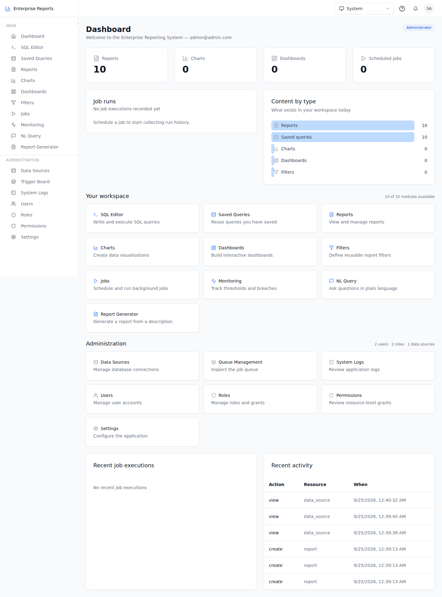
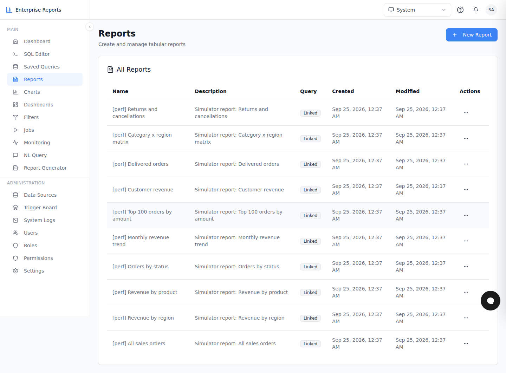
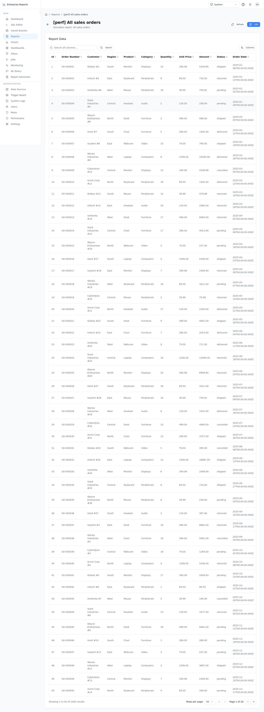
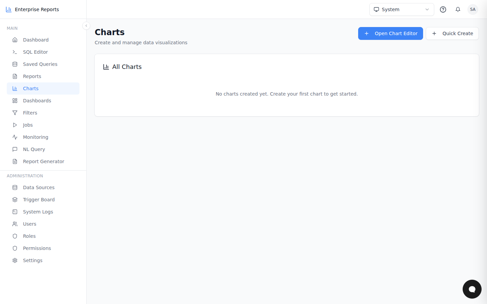
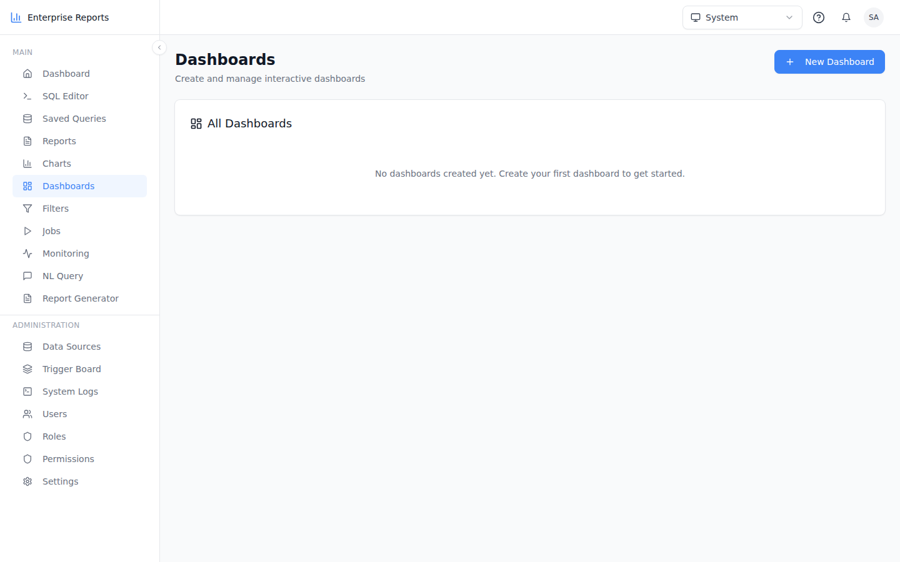
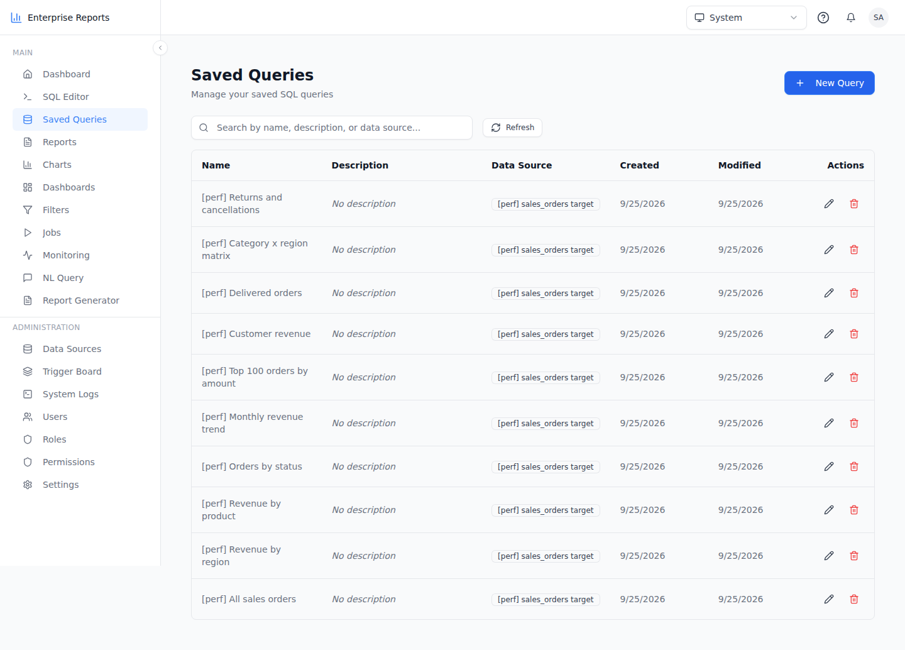
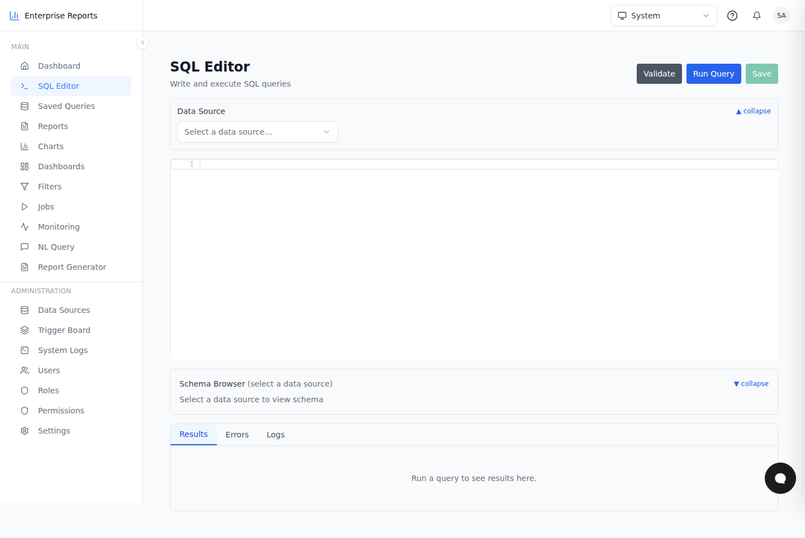
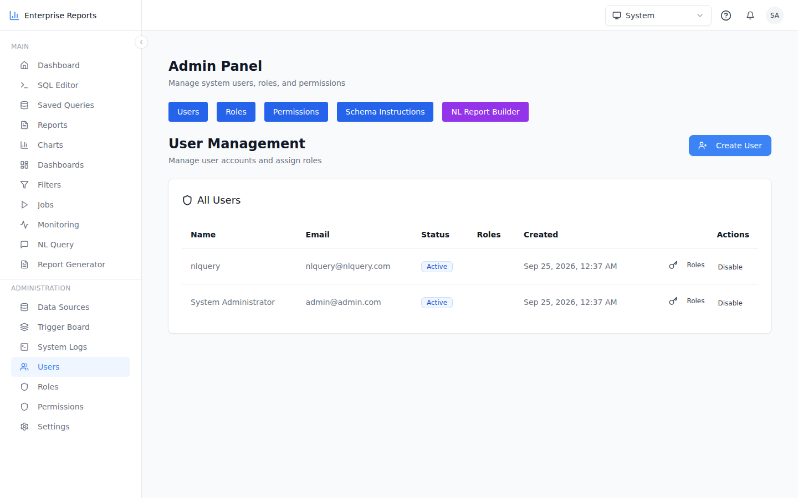
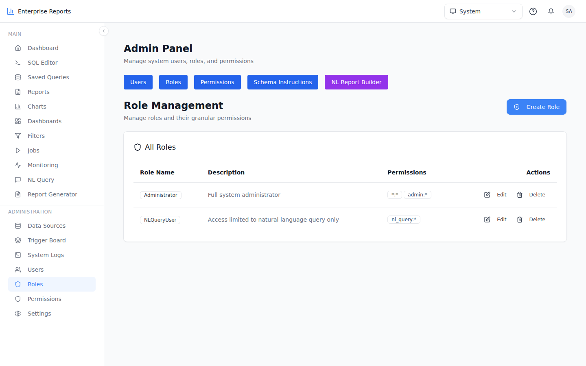

# TanStack Start vs Rust (Loco) Enterprise Reporting: performance and QA

Run on 2026-09-25. Two installations were started side by side, each against its own
PostgreSQL 16 config database, and both reporting over the **same 1000-row target entity**.

| | TanStack Start edition | Rust edition |
|---|---|---|
| Repo | `enterprise_reporting_tanstack` @ `02b3f41` | `enterprise_reporting_rust` @ `2c7b5ab` |
| Backend | TanStack Start server functions / API routes on Bun | Loco.rs `ers-backend-cli start --all` (release build) on :5150 |
| Frontend | same TanStack UI, `bun server-static-wrapper.mjs` on :3000 | same TanStack UI, `bun server-static-wrapper.mjs` on :3001, `/api` proxied to Rust |
| Config DB | `ts_config` | `rs_config` |

Host: 4 vCPU, 15 GB RAM, one container, PostgreSQL local. Only one app was under load at a time.

## Target entity: 1000 records

`perf_target.sales_orders` holds **1000 rows**: order number, customer, region, product, category,
quantity, unit price, amount, status and order date. Totals come to 5 regions × 200 orders, 8 products and
5 statuses, and the amounts sum to about 3.65M. Both installations register it as a `pg` data source with
the same encrypted connection config.

## The 200-report simulator

`scripts/perf/report-simulator.ts` creates 10 saved queries and 10 report definitions over
`sales_orders` (all rows, revenue by region, product, status or month, the top 100, customer revenue,
delivered orders, a category×region matrix, returns). It then runs **200 simulated reports** through the
public API that both backends serve:

- **Mix (deterministic, identical for both):** 50% paged data (`GET /api/reports/:id/data`, which is what the
  viewer loads), 20% CSV, 15% XLSX and 15% PDF (`POST /api/reports/:id/export`)
- **Phases:** sequential (1 in flight), 10 concurrent, and **200 simultaneous** (every request in flight at once)
- A warm-up of 20 runs is not counted. Every phase was run at least twice.

```bash
bun scripts/perf/report-simulator.ts --base http://localhost:3000 --label tanstack-node \
  --password "$ADMIN_PASSWORD" --runs 200 --concurrency 200 --out ./perf-results
```

## Results: 200 simultaneous report requests

All 200 requests were fired at once. Round 2 is the warm steady state; round 1 includes Rust growing its
connection pool from cold.

| Round | App | OK | Wall time | Throughput (reports/s) | Mean ms | p50 | p95 | p99 | Max |
|---|---|---|---|---|---|---|---|---|---|
| r1 | **TanStack** | 200/200 | 6.52 s | 30.6 | 5058 | 6019 | 6460 | 6515 | 6524 |
| r1 | **Rust** | 200/200 | 1.15 s | 172.5 | 460 | 372 | 1151 | 1155 | 1157 |
| r2 | **TanStack** | 200/200 | 6.52 s | 30.6 | 4633 | 5336 | 6459 | 6522 | 6525 |
| r2 | **Rust** | 200/200 | **0.39 s** | **505.5** | **287** | **312** | **383** | **392** | **393** |

**Per format, 200 simultaneous (r2), p50 / p95 in ms:**

| App | data (JSON page) | CSV | XLSX | PDF |
|---|---|---|---|---|
| TanStack | 6292 / 6398 | 3540 / 5915 | 6391 / 6524 | 3620 / 5946 |
| Rust | 364 / 391 | 234 / 345 | 264 / 362 | 231 / 344 |

Under full simultaneous load the Rust edition finished all 200 reports **~16× faster** (0.39 s vs 6.52 s)
and its slowest request (393 ms) was faster than TanStack's fastest median. Neither app failed a request.
TanStack's throughput stays flat at about 30 reports/s from 10 to 200 in flight, so the single-threaded
Bun server is saturated, and extra concurrency only lengthens the queue.

## Results: sequential and 10-concurrent (200 reports each)

| Phase | App | OK | Wall | Reports/s | Mean ms | p50 | p95 | p99 | Max |
|---|---|---|---|---|---|---|---|---|---|
| sequential r1 | TanStack | 200/200 | 8.53 s | 23.4 | 42 | 16 | 226 | 298 | 310 |
| sequential r1 | Rust | 200/200 | 1.59 s | 125.2 | 7 | 6 | 29 | 32 | 36 |
| sequential r2 | TanStack | 200/200 | 8.08 s | 24.7 | 40 | 14 | 222 | 266 | 306 |
| sequential r2 | Rust | 200/200 | 1.66 s | 120.3 | 8 | 6 | 18 | 32 | 45 |
| 10 concurrent r1 | TanStack | 200/200 | 6.80 s | 29.3 | 331 | 220 | 988 | 1356 | 1456 |
| 10 concurrent r1 | Rust | 200/200 | 0.49 s | 403.2 | 23 | 17 | 57 | 145 | 194 |
| 10 concurrent r2 | TanStack | 200/200 | 6.88 s | 29.0 | 338 | 247 | 981 | 1393 | 1489 |
| 10 concurrent r2 | Rust | 200/200 | 0.47 s | 420.6 | 22 | 19 | 45 | 65 | 86 |

**Sequential, per format (mean / p95 ms):**

| App | data | CSV | XLSX | PDF |
|---|---|---|---|---|
| TanStack | 15.8 / 26.9 | 16.4 / 59.0 | 87.9 / 216.1 | 121.1 / 301.5 |
| Rust | 6.0 / 9.2 | 5.7 / 9.9 | 16.3 / 32.3 | 8.7 / 15.1 |

PDF shows the largest gap (~14× on the mean). jsPDF rendering on the Node event loop is what serialises
TanStack under concurrency.

**The proxy costs little.** Hitting Loco directly on :5150 gave a sequential p50 of 5 ms and 464 reports/s
at 10 concurrent, against 6 ms and 403–420 reports/s through the Bun frontend proxy.

**Memory (RSS after the runs):** TanStack server 490 MB. Rust edition: Loco 72 MB plus a 315 MB Bun SSR frontend.

### Correctness: the two backends return the same data

- The total rows per report are identical on both (All = 1000, Customer revenue = 370, Returns + cancellations = 408, Top = 100, Monthly = 20, and so on).
- The paged JSON payloads are byte-identical in size (mean 4282 B).
- Both PDFs are 42 pages. XLSX sizes are within 5%.
- **The CSV exports differ, and the Node one is wrong:** Node writes a `DATE` column as
  `Wed Jan 08 2025 00:00:00 GMT+0000 (Coordinated Universal Time)`, where Rust writes `2025-01-08T00:00:00.000Z`.
  That difference accounts for the 140 KB vs 102 KB file size.

## Page-load timings (gstack browse, 1440×900, warm, signed in as admin)

The `ttfb`, `domReady` and `load` columns come from Navigation Timing. `settled` is the time until the network was idle.

| Page | TanStack ttfb | TanStack load | TanStack settled | Rust ttfb | Rust load | Rust settled |
|---|---|---|---|---|---|---|
| Dashboard | 84 | 363 | 1048 | 91 | 390 | 1060 |
| Reports list | 1113 | 1424 | 2485 | 1212 | 1531 | 2609 |
| Report viewer (1000 rows) | 52 | 335 | 1039 | 27 | 329 | 983 |
| Charts | 34 | 360 | 1346 | 27 | 252 | 1264 |
| Dashboards | 26 | 318 | 946 | 20 | 321 | 940 |
| Saved queries | 19 | 363 | 1001 | 17 | 301 | 952 |
| SQL editor | 62 | 421 | 2053 | 40 | 326 | 1917 |
| Data sources | 24 | 315 | 1261 | 30 | 346 | 1266 |
| Admin: users | 23 | 342 | 984 | 27 | 308 | 953 |
| Admin: roles | 20 | 314 | 961 | 20 | 347 | 989 |

With a single user, page loads are equivalent (within ±10%). Page loads are dominated by the shared
frontend bundle, not by the backend. The backend gap only shows under load.

## Look and feel: gstack `/qa` findings

Both editions render **the same UI**, with pixel-identical layout, typography, sidebar, cards and data grid,
because the Rust port replaced only the backend. The screenshots below are paired by page. They are full-page captures, so the sidebar, which is `fixed h-screen` and stays pinned while you scroll, ends at 900 px in them.

| # | Severity | Applies to | Finding |
|---|---|---|---|
| 1 | High | both | `bun run start` (`bun dist/server/server.js`) serves the SSR HTML but **404s every `/assets/*.js`**, so the page never hydrates and **Sign In does nothing**. `bun server-static-wrapper.mjs` works, and was used for everything here. |
| 2 | Medium | TanStack only | CSV export formats `DATE` columns with JS `Date.toString()` (see above). |
| 3 | Medium | both | The `/reports` list has a TTFB of 1.1–1.2 s on both editions, 10–50× every other page, so the cost is in SSR rather than the backend. |
| 4 | Medium (env) | both | 15–17 console errors on Reports, Charts, SQL editor and Data sources: CopilotKit agent runs fail (`onRunFailed`) because no Mastra server is running here. They come from the environment and appear identically on both. |
| 5 | Low | both | The report viewer shows a `DATE` column as `2025-01-08T00:00:00.000Z`, which wraps onto two lines in every row. |

**Health score (gstack rubric):** TanStack **80**, Rust **82**. The two points separating them are finding 2.

## Screenshots

| Page | TanStack Start | Rust (Loco) |
|---|---|---|
| Login |  |  |
| Dashboard |  |  |
| Reports |  |  |
| Report viewer |  |  |
| Charts |  |  |
| Dashboards |  |  |
| Saved queries |  |  |
| SQL editor |  |  |
| Data sources |  |  |
| Admin: users |  |  |
| Admin: roles |  |  |

The raw per-phase summaries are in `results/`, and the page timings are in `results/ui-*.tsv`.

## Caveats

- Everything ran in one 4-vCPU container, with PostgreSQL alongside and the client on the same host. Absolute numbers will differ in production, but the ratios are the point.
- The Apache AGE and pgvector extensions were not installed, so knowledge-graph init failed as a non-fatal error on both. NL query and CopilotKit were not exercised.
- TanStack logged a `relation "monitoring_rules" does not exist` from the cron runner on first boot. It raced `bootstrapSchema()` and was non-fatal.
