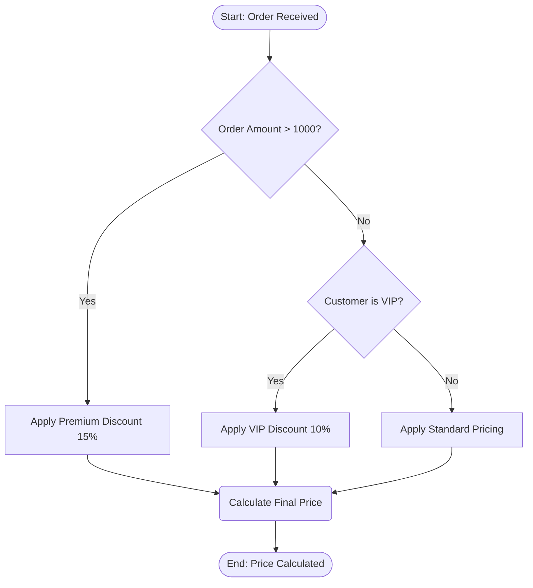
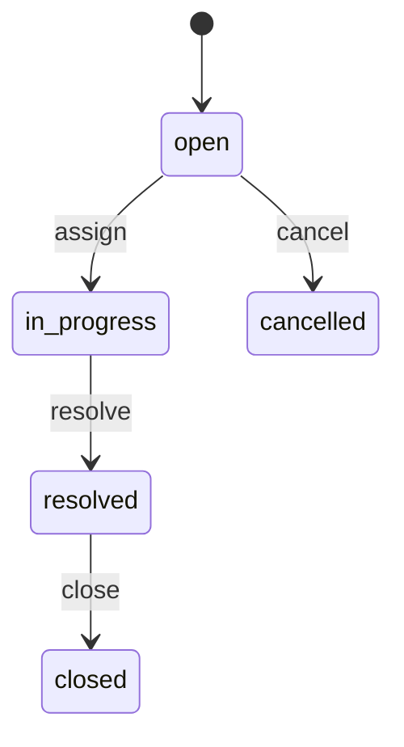

# EML — Enterprise Reporting Modeling Language

**EML** is a Mermaid-based language for describing an application's
**Entity Relationship Diagram (ERD)**, its **business rules**, and its
**business workflows** — all in one artifact. The `eml` CLI reads it and
produces a complete enterprise_reporting_tanstack-style application.

Every EML document is **valid, renderable Mermaid**. EML is a *semantic superset*:
it assigns generator meaning to standard Mermaid diagrams (`erDiagram`,
`flowchart`, `stateDiagram-v2`) and to renderer-safe `%%` directive comments.

> Based on the official Mermaid references for
> [Entity Relationship Diagrams](https://mermaid.js.org/syntax/entityRelationshipDiagram.html)
> and [Flowcharts](https://mermaid.js.org/syntax/flowchart.html).

---

## Target stack

The `enterprise-reporting` generator target (default) produces:

```
MyApp/
├── src/
│   ├── server-fns/<entity>.ts    # TanStack Start server functions (.inputValidator())
│   ├── routes/_authed/<entity>/
│   │   ├── index.tsx             # List page (TanStack Table + shadcn/ui)
│   │   └── $id.tsx               # Detail/edit page (shadcn/ui form)
│   └── lib/db/
│       ├── kysely-db.ts          # Kysely Database interface extension
│       └── migrations/           # SQL CREATE TABLE statements (MariaDB)
├── package.json
└── README.md
```

Technology choices match the parent repository:
- **TanStack Start v1** (SSR, file-based routing)
- **Kysely** ORM for DB access
- **MariaDB** for the config database
- **shadcn/ui + Tailwind CSS** for the UI layer
- **Bun** as the runtime

---

## The definition file

The **full language** is defined in one machine-readable file:

```
language/erdwithai-language.json
```

This JSON is the **single source of truth** for the language: type vocabulary,
modifiers, relationship cardinalities, hook types, directive definitions,
and the generator contract. Everything else in this folder documents or loads it.

Load it from code via the typed accessor:

```ts
import {
  loadLanguageDefinition,
  normalizeType,
  cardinalityKind,
  isHookType,
} from "../language";

const def = loadLanguageDefinition();
normalizeType("varchar");     // "string"
cardinalityKind("||--o{");    // "oneToMany"
isHookType("beforeCreate");   // true
```

---

## Folder layout

```
language/
├── README.md                     # This file
├── erdwithai-language.json       # ⭐ Canonical, machine-readable language definition
├── index.ts                      # Typed loader/accessor
├── composer.ts                   # Writes a complete EML document
├── rag.ts                        # EML → retrieval chunks for RAG
├── checker.ts                    # Validator — `bun language/checker.ts <file.mmd>`
├── fixer.ts                      # Auto-fixes the checker's fixable codes
├── grammar/
│   └── erdwithai.ebnf            # Formal EBNF grammar
├── spec/
│   ├── 00-overview.md            # Concepts, document structure, sections
│   ├── 01-erd.md                 # ERD reference
│   ├── 02-business-rules.md      # Business-rules (decision-flow) reference
│   ├── 03-workflows.md           # Workflow (hooks + state) reference
│   ├── 04-types-and-modifiers.md # Type vocabulary, modifiers, cardinalities
│   └── 05-directives.md          # Reserved %% directive reference
├── cli/                          # The `eml` CLI — parse, validate, generate apps
│   ├── README.md
│   ├── eml.ts                    # Executable entrypoint (run with Bun)
│   └── src/
│       ├── cli.ts                # CLI argument parsing and command dispatch
│       ├── parser.ts             # EML document parser
│       ├── validator.ts          # Model-level validation
│       ├── model.ts              # EmlModel TypeScript types
│       ├── util.ts               # String utilities
│       └── generate/
│           ├── app.ts            # node-rest generator (dependency-free Node app)
│           └── enterprise-reporting.ts  # TanStack Start + Kysely generator
└── examples/
    ├── helpdesk.eml.mmd          # Helpdesk support-ticket model
    ├── inventory.eml.mmd         # Inventory management model (enterprise-reporting target)
    ├── ecommerce.eml.mmd         # Full e-commerce model
    └── minimal.eml.mmd           # Smallest complete example
```

## The `eml` CLI

```bash
# Validate a model (writes model.mmd.error beside it)
bun language/cli/eml.ts validate -i language/examples/helpdesk.eml.mmd

# Generate a TanStack Start + Kysely app (enterprise-reporting stack)
bun language/cli/eml.ts generate -i model.eml.mmd -o ./out --stack enterprise-reporting

# Generate a dependency-free Node app (node-rest stack)
bun language/cli/eml.ts generate -i model.eml.mmd -o ./out --stack node-rest

# Show language info
bun language/cli/eml.ts info
```

Flags: `--input / -i`, `--output / -o`, `--name`, `--stack`, `--docker`,
`--github <owner/repo>`, `--force`, `--no-autofix`, `--json`, `--help`.

---

## Three sections at a glance

### 1. ERD — structure

```mermaid
erDiagram
    Category {
        string id PK
        string name UK
        string description OPTIONAL
    }
    Product {
        string  id PK
        string  category_id FK
        string  sku UK
        decimal price
        integer stock_quantity
    }
    Category ||--o{ Product : "contains"
```

### 2. Business rules — declarative decision logic



### 3. Workflows — lifecycle hooks & state machines



---

## Validation

```bash
bun language/checker.ts model.mmd          # validates; writes model.mmd.error
bun language/fixer.ts   model.mmd.error    # auto-fixes fixable codes, re-checks
```

See `spec/` for the full language reference and `erdwithai-language.json` for
the machine-readable contract.

For the full enterprise_reporting_tanstack system description — architecture,
conventions, server functions, auth, NL query, RBAC — see
[`../llmtext/llms-full.txt`](../llmtext/llms-full.txt).
