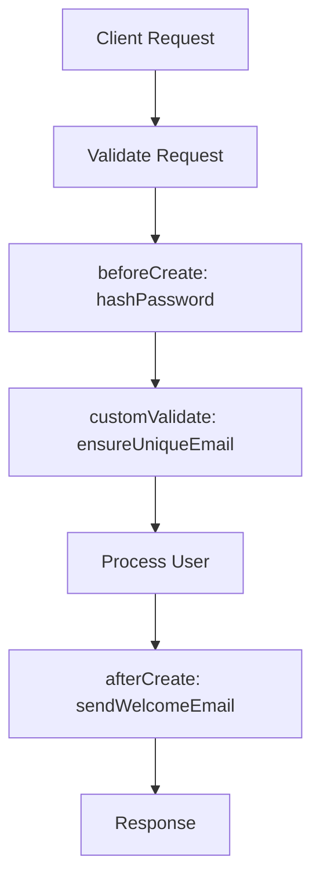
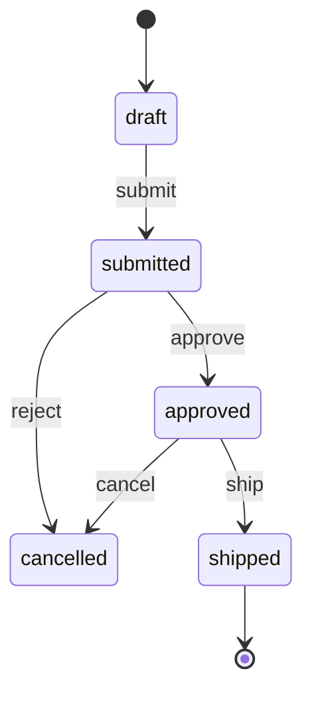
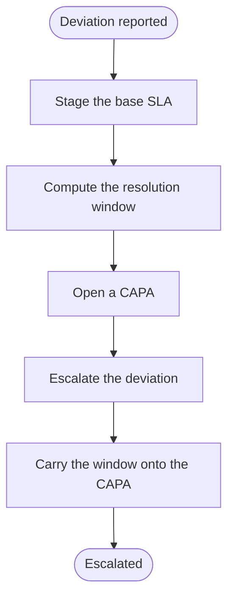
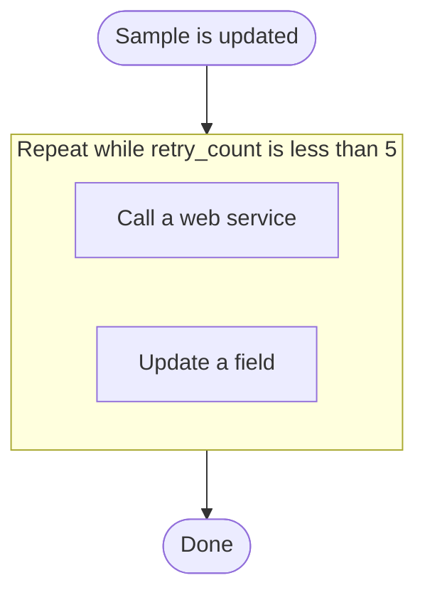

# EML — Business Workflows

A **workflow** describes *process*: the imperative logic that runs around entity
lifecycle events, and the longer-running state a business object moves through.
EML expresses workflows two ways:

1. **Hook workflows** — a `flowchart` annotated with `%%hook` directives that
   bind named handlers to entity CRUD lifecycle events. Parsed by
   `packages/web/src/lib/workflow/hook-parser.ts`.
2. **State workflows** — a `stateDiagram-v2` whose states map to a status enum
   and whose transitions define the allowed status changes for an entity.

## 1. Hook workflows

### The hook directive

```
%%hook <hookType> <handlerName> on <EntityName>[<params>]
```

- `hookType` — one of the 13 lifecycle events (below).
- `handlerName` — `^[a-zA-Z_][a-zA-Z0-9_]*$` (the generated function name).
- `EntityName` — the entity the handler runs for.
- `params` — optional `[field: name, field: name]` to scope the hook to fields.

Examples:

```
%%hook beforeCreate hashPassword on User
%%hook afterCreate  sendWelcomeEmail on User
%%hook beforeCreate generateSlug on Post[field: slug]
%%hook customValidate ensureCreditLimit on Order
```

### What a hook directive generates

Each directive becomes a function in the generated backend, in a module per
entity:

```
backend/src/modules/hooks/
├── handlers/
│   ├── User.ts        # one exported function per handler declared for User
│   └── index.ts       # the registry, generated from the directives
└── hooks.ts           # the executors the bus service calls
```

`handlers/<Entity>.ts` is written **once** and then left alone — the bodies are
application logic, so regenerating the project never overwrites them. A hook
added to the model later is appended to the existing module. `handlers/index.ts`
is pure wiring and is rewritten on every generation.

A handler's signature follows its phase:

| Phase | Receives | Returns |
|-------|----------|---------|
| `before*` | the payload | the payload to use (return it, changed or not) |
| `after*` | the record | nothing — side effects only |
| `beforeDelete` | the id | `false` to block the delete |
| `customValidate` | the record | nothing — **throw** to reject the write |

`customValidate` runs on every create and update, against the record as it will
look after the write, so a validation over a field absent from a partial update
still holds.

The entity a hook binds to is matched however the caller spells it: the REST
route sends `bus_compound`, the UI sends `chemical-inventory`, the model says
`ChemicalInventory` — all three resolve to the same handlers.

### The 13 hook types

| Hook | Phase | Op | Typical use |
|------|-------|----|-------------|
| `beforeCreate` | before | create | hash password, generate slug, set defaults |
| `afterCreate` | after | create | welcome email, emit event |
| `beforeUpdate` | before | update | validate/transform before write |
| `afterUpdate` | after | update | audit, cache invalidation |
| `beforeDelete` | before | delete | block delete if referenced |
| `afterDelete` | after | delete | cleanup files/related rows |
| `beforeQuery` | before | query | tenant scoping, filter injection |
| `afterQuery` | after | query | post-process result rows |
| `customValidate` | validate | any | cross-field / business validation |
| `beforeRead` | before | read | guard single-record read |
| `afterRead` | after | read | redact/enrich a record |
| `beforeList` | before | list | adjust filter/sort/pagination |
| `afterList` | after | list | post-process a page of results |

Handlers are wired into the generated `BaseService` and run through
`globalHookExecutor` around the corresponding CRUD operation.

### Complete hook workflow — user signup



The flowchart is the human-readable process; the `%%hook` directives are the
machine-readable binding. The two stay in sync in one artifact.

## 2. State workflows

Use `stateDiagram-v2` for an entity that moves through named states (order
fulfilment, approval, subscription lifecycle).

```
[*]        --> FirstState
StateA     --> StateB : eventName
LastState  --> [*]
```

- States are treated as a **status enum** for the bound entity.
- Transitions define the **allowed status changes**; the transition label is the
  triggering event/action.
- Bind with `%%workflow ... kind: state` and (optionally) restrict transitions
  by role with `%%rbac`.

### What a state workflow generates

Each state workflow becomes a row in `sys_workflow_definitions`, holding BPMN the
generated backend executes. The generator already seeds a `trigger-workflow` rule
per entity for create and update; those rules resolve a definition **by name**
(`<table>-on-create-workflow`), so one is seeded for every entity:

| The model declares | The generated definition does |
|--------------------|-------------------------------|
| a state machine for the entity | puts a new record into the starting state — the `[*] --> x` edge — writing `x` to the entity's `status` column, or `workflow_status` when it has none |
| nothing for that entity | runs a single no-op, so the workflow run still exists and is visible in the run list |

The full machine (every state and transition, with its trigger labels) is recorded
in the definition's description, so the Workflow Designer shows what was drawn.

Without the definitions, every write logged *"No active workflow named … —
nothing to trigger"* and no run was ever recorded.

### Complete state workflow — order fulfilment



## 3. Saga workflows — multi-step processes

Use `%%workflow ... kind: saga` for a process that takes several steps, touches
more than one entity, and carries values from one step into the next: escalate a
deviation and open a CAPA, admit a patient, run a checkout.

A saga is a `flowchart` whose **edges give the running order** and whose nodes
are bound to executable steps by `%%step` directives. The flowchart is the
picture a reader sees; the directives are what the generator compiles. Same
division of labour as `%%hook` — one artifact, both halves in sync.

```
%%step <nodeId> <stepType> <key>: <value> ...
```

- `nodeId` — a node in the same flowchart. A `%%step` naming a node that is not
  there is an error, not a silent no-op.
- `stepType` — `UpdateEntity`, `CreateEntity`, `DeleteEntity`, `Decision`,
  `Formula`, `REST` or `Agent`.
- properties — space-separated `key: value`. A value runs to the next `<key>:`
  token, so it may contain spaces. **`fields` is JSON and must be last on the
  line.**

### The trigger

```
%%workflow <name> entity: <Entity> kind: saga [trigger: automatic|rule] [operation: CREATE|UPDATE|DELETE|ALL]
```

| `trigger` | When it runs |
|-----------|--------------|
| `automatic` (default) | on every write to the entity matching the workflow's operation |
| `rule` | only when a business rule emits a `trigger-workflow` action naming it |

Choose `rule` whenever the workflow should not fire on every write — that is
what makes the rule's condition load-bearing. A `trigger: automatic` workflow
gated on a condition would run regardless of it.

`operation` says which write runs it and defaults to `CREATE`. It is only
consulted for `trigger: automatic`; a rule-triggered workflow is resolved by
name, so the rule decides.

### Passing values between steps

Steps share one context: the triggering record's columns, plus every variable a
previous step published.

- `CreateEntity` publishes the new row's id under `as`
- `Formula` publishes under `target`
- `Decision` publishes one variable per output column of the row that matched
- a later step reads one by naming it in `source` or `targetSource`

Without this a workflow could insert a row and then never reach it again, so it
could only ever touch the record it started from.

### The step types

| Type | Required | Optional | Does |
|------|----------|----------|------|
| `UpdateEntity` | `field`, and one of `source`/`value` | `entity`, `targetField`, `targetSource` | writes one column |
| `CreateEntity` | `entity`, `fields` | `as` | inserts a row, publishing its id |
| `DeleteEntity` | — | `entity`, `targetField`, `targetSource`, `hard` | soft-deletes (stamps `deleted_at`); `hard: true` removes the row |
| `Decision` | one of `decisionTable`/`rule` | `publish` | evaluates a GoRules table and publishes its outputs |
| `Formula` | `target`, `operation` | see below | publishes a value into the context |
| `REST` | `url` | `method`, `bodyTemplate` | calls an external endpoint |
| `Agent` | `agentId` | — | placeholder pending Mastra integration |

`Formula` operations: `multiply`, `divide`, `add`, `subtract` (need `source` +
`operand`, both coerced to Number), `set` (needs `value`, stored **unchanged** —
the only way to pass text to a later step) and `copy` (needs `source`, carried
across unchanged).

**Decision** puts a GoRules decision table inside the process, so a branch lives
where the process does rather than in a rule that triggers a second workflow.

- `decisionTable` — the table as JSON, `{ hitPolicy, inputs, outputs, rules }`,
  for logic only this process cares about. The generator wraps it in the
  input → table → output graph the engine evaluates, so a step never carries
  that plumbing. Like `fields`, it is JSON and must be last on the line.
- `rule` — the name of a rule declared elsewhere in the model, for when the same
  table already governs the entity and the process should not fork a copy of it.
- `publish` — a comma-separated allow-list, when a table emits more columns than
  the process needs. Omitted, every output column is published.

Outputs land in the context under their `field` name, so a later step reads one
exactly as it reads any other variable. A table that matches no row publishes
nothing — that is how "leave it alone" is expressed, not an error, and the steps
that would have read its variables skip themselves.

Every row must set every output column. The engine silently discards a row that
leaves one unset, and a single such row stops the whole table matching, so the
checker refuses it (EML272).

**Row targeting**, for `UpdateEntity` and `DeleteEntity`. With no `entity` the
step acts on the record that triggered the workflow. To reach another entity,
set `entity` plus either `targetSource` (a context key holding the row id) or
`targetField` (a foreign key column matched against the triggering row).
Targeting another entity by `id` with no `targetSource` is **refused** rather
than guessed — updating the wrong row is bad, deleting it is worse.

### Complete saga — escalate a critical deviation



Step D creates the CAPA and publishes its id as `newCapaId`; step F reaches that
exact row and writes the value step C computed from what step B staged. Nodes
`A` and `G` carry no `%%step` — they are terminals, drawn for the reader.

### What a saga generates

One row in `sys_workflow_definitions`, holding BPMN with one
`bpmn:serviceTask` per `%%step`, wired in flowchart edge order, plus
`trigger_type` from `trigger:`. The generated executor walks the sequence flows,
so the steps run in the order they were drawn. A node with a `%%step` but no
edges still runs, after the wired ones, in document order — the canvas implies a
step runs even when the connection was left implicit.

Definitions that come from the model are seeded with `source: 'model'`. **The
model owns them**: regeneration rewrites them, and the generated Workflow
Designer shows them read-only with a pointer back to the model. Workflows
authored in the app carry `source: 'designer'` and are never touched by
regeneration — so the two ways of authoring cannot silently clobber each other.

### Compensation

A saga that needs rollback pairs each forward step with a compensating one — a
`DeleteEntity` undoing a `CreateEntity`, an `UpdateEntity` restoring a prior
value. The executor runs a linear chain, so compensation is expressed as
explicit steps rather than inferred; automatic compensating-transaction
orchestration remains extended conformance.

## Automations — the form the builder writes

A saga is the general surface. The **automation** is the constrained profile of
it that the shipped builder reads and writes, and it is how workflows and
business rules are authored in both the generator and generated applications.

An automation is one sentence:

> When a `DeviationReport` **is created**, only if `status` **is** `"open"`,
> then look up a rule table, create a record, and write a field back.

A trigger, a flat list of conditions that must all pass, and an ordered list of
steps. There is deliberately no graph — the executor runs steps in order and
stops at the first failure, so a list is the honest representation, and it is
what lets the builder draw a ladder without inventing layout nobody asked for.

It is not a second language. It serialises to the same mermaid flowchart with
the same `%%step` directives, so an automation renders as a diagram anywhere
Mermaid runs and executes through the existing executor.

```mermaid
flowchart TD
%%meta kind: workflow
%%workflow name: Escalate critical deviations
%%hook afterCreate on DeviationReport
%%guard severity eq "critical"
  start([DeviationReport is created])
  guard{severity is "critical"}
  s1[Look up Escalation tier]
%%step s1 type: Decision as: tier
%%step s1 ruleTable: Escalation tier
  s2[Create a CAPA]
%%step s2 type: CreateEntity as: capaId
%%step s2 entity: CAPA
  s3[Set status]
%%step s3 type: UpdateEntity
%%step s3 field: status
%%step s3 value: {{tier}}
  done([Done])
  start --> guard
  guard --> s1
  s1 --> s2
  s2 --> s3
  s3 --> done
```

### How it differs from a saga

| | Saga | Automation |
|---|---|---|
| Name and entity | `%%workflow <Name> entity: <E> kind: saga` | `%%workflow name: <name>`, entity from `%%hook` |
| Step type | positional — `%%step B Formula …` | a key — `%%step s1 type: Formula` |
| Properties | all on one line | one line per key, sharing the node id |
| Conditions | drawn as decision nodes | `%%guard` lines |

Both compile to the same executable steps, and **both are read by both sides**:
a model authored by hand opens in the builder, and an automation built in a
running application compiles through the generator. The translation happens at
the edges — the builder maps a saga's `fields` onto `values` and a Formula's
`target`/`source`/`operand` onto `as`/`left`/`right`; the generator maps back and
unwraps `{{name}}` references into the bare `source:` a saga uses. Downstream,
only saga vocabulary exists, so the checker and the BPMN emitter never learn
there is a second dialect.

### Triggers

`%%hook <hookName> on <Entity>` — the two-token form of `%%hook`, with no
handler name. The event is the lifecycle hook the generated services already
fire, so a trigger is not a new concept.

| Builder wording | `%%hook` name | Can still block the write |
|---|---|---|
| is created | `afterCreate` | no |
| is about to be created | `beforeCreate` | yes |
| is updated | `afterUpdate` | no |
| is about to be updated | `beforeUpdate` | yes |
| is deleted | `afterDelete` | no |
| is about to be deleted | `beforeDelete` | yes |

### Conditions

`%%guard <field> <operator> <jsonValue>`. All of them must pass. There is no OR
and no nesting: an author who needs alternatives writes a second automation,
which stays readable where a boolean tree does not. Zero conditions means the
automation always runs.

Operators: `eq`, `neq`, `gt`, `gte`, `lt`, `lte`, `contains`, `startsWith`,
`isEmpty`, `isNotEmpty`, `changed`. The last three take no value.

> **`%%guard` used to mean two unrelated things.** It also spelled an RBAC role
> restriction (`%%guard role:admin on Order.delete`). That sense is now
> [`%%rbac`](05-directives.md#rbac--rbac-guard). The RBAC side was the one
> renamed because it had no shipped parser and no stored data — it lived only in
> this spec — whereas renaming the condition form would have meant rewriting
> every stored automation.
>
> A model written before the rename may still carry the old RBAC shape under
> `%%guard`. The automation reader detects it and skips it, rather than reading
> it as a check on a field called `role:admin` with an operator of `on` — a
> condition that can never pass, which would silently disable the automation.

### Steps

`%%step <nodeId> type: <StepType> [as: <name>]`, then one line per property.
`as:` publishes a result that later steps can read.

| Type | Properties | Does |
|---|---|---|
| `Decision` | `ruleTable`, `inputs` | Evaluates a rule table, publishes its outputs |
| `CreateEntity` | `entity`, `values` | Creates a record on another entity |
| `UpdateEntity` | `entity`, `field`, `value` | Writes a field, by default on the triggering record |
| `DeleteEntity` | `entity`, `target` | Removes a record |
| `Formula` | `operation`, `left`, `right` | Computes a value and publishes it |
| `REST` | `method`, `url`, `body` | Calls an external service |

### Loops — repeating steps while a rule holds

```
%%loop <loopId> while: <field> <operator> <value> max: <n>
%%step <nodeId> in: <loopId>
```

The steps that name a loop run in order and repeat for as long as the check
passes. The loop ends the first time it fails. Members are drawn as a Mermaid
`subgraph`, so the repetition is visible in any renderer rather than living only
in the directives:



**The check is re-read before every pass**, against the record as it stands
then. That is the point: a step inside the loop changes the record, and that
change is what ends the loop. It uses the same eleven operators as an
automation's conditions — one vocabulary for every check in the language.

#### `max:` — every loop declares its own ceiling

A while-loop is genuinely unbounded, and an automation runs **inside the write
that triggered it**. A check that never fails does not spin a harmless
background job — it holds a database transaction open until something times out.

So `max:` is **required**. There is no default and no engine-wide constant:
how many passes is obviously too many is a property of the work, not of the
engine. A retry that should give up after 5 and a reconciliation that
legitimately runs 800 cannot share one number without the ceiling being
meaningless for one of them.

After `max` passes the loop is abandoned and the run is marked `FAILED`, naming
the loop and the limit. This is a backstop, not a second way to spell a count:
reaching it means the automation is wrong, so it is reported rather than
finishing quietly as though the loop had ended on its own.

A loop with no `max` is refused by the builder and warned about by the compiler.
An executor meeting one anyway runs a single pass and gives up — the safe
direction for a loop nobody bounded is not to run it.

#### The check must be able to change

A loop whose check reads a field that no member step writes is **refused when
the model compiles**. It would read the same on every pass, so it either never
runs or runs until the safety limit cuts it off — and both are invisible until
it is live.

The check is deliberately shallow: it matches `UpdateEntity` writes by field
name and treats every other step type as able to change anything. A `REST` call
or a `Decision` can change the world in ways static analysis cannot see, so it
reports only the case it is certain about.

**Loops do not nest.** A step names at most one `in:`. Flattening nested repeats
is what keeps the ladder readable and the cost predictable.

Inside a loop, a step sees everything it would outside, plus
`{{<loopId>.iteration}}` — the 1-based pass number. A value published inside the
loop is overwritten each pass, so afterwards it holds what the last pass left.

### References

A step can read fields of the triggering record and the published results of
every step above it, written in double braces:

- `{{deviationreport.severity}}` — a field of the triggering record, entity name lowercased
- `{{tier}}` — the result of an earlier step, named by its `as:`

Resolution is positional: a step sees only what precedes it, which is what makes
the ladder safe to reorder.

### The drawn nodes carry no meaning

Every node is regenerated from the directives on write, and readers take meaning
only from the `%%` lines. The flowchart exists so the document renders as a
diagram — editing the boxes by hand changes nothing.

## Combining hooks, rules, and state

A single entity can carry all three: an ERD block (structure), `%%rule`
decision flows (declarative logic), `%%hook` handlers (imperative side effects),
and a `stateDiagram-v2` (status lifecycle). Keeping them in one EML file makes
the entity's full behavior reviewable in one place — and renderable as diagrams.
See [`examples/crm.eml.mmd`](../examples/crm.eml.mmd).
